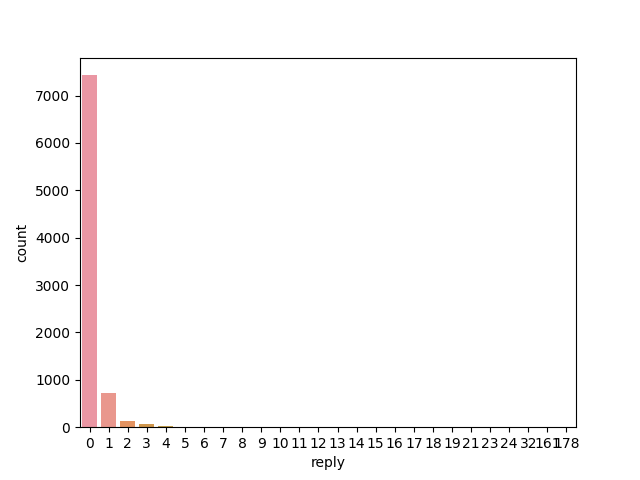

# What we talk about when we talk about Affordable Housing

## Context

According to the U.S. Department of Housing and Urban Development, Affordable Housing is generally defined as housing on which the occupant is paying no more than 30 percent of gross income for housing costs, including utilities.

The U.S. has a shortage of 7 million rental homes affordable and available to extremely low-income renters, whose household incomes are at or below the poverty guideline or 30% of their area median income. Only 36 affordable and available rental homes exist for every 100 extremely low-income renter households.

In this project, I hope to answer the following questions:

What aspects of affordable housing do people care about?

How do people feel about it?

Where is the discussion happening and who are involved?


## Data Collection

Search on twitter the hashtag [#affordablehousing](https://twitter.com/search?q=%23affordablehousing&src=typed_query&f=live) and we will likely find the following: successful housing projects and campaigns, advertisement for houses for sale or for rent, complaints on expensive housing prices, and appeals for more affordable housing initiatives.

I scrapped twitter data under the hashtag #affordablehousing posted between the beginning of Feburary and the end of May this year. For scrapping, I used the package selenium that  opens a chrome driver and allows me to scroll down the page while scrapping, which cannot be achieved through beautifulsoup. 

I did try to parallelize the scrapping process but unfortunately the action of openning up a web driver cannot be executed within a lambda function. I ended up scrapping data locally, storing it in csv files and uploaded them to an S3 bucket.

This serial scrapping creates a bottleneck for the project and will not scale well if a larger amount of data is needed.


## Visualization

After reading the data with spark, I performed aggregation on some of the metadata scrapped alongside the text and visualized the results.

Below are distributions of the number of posts per number of reply, like and retweet. We can see that most of these posts don't receive much attention online. 




Below is the distribution of time of day when the tweets are posted. It may be exaggerated because the way I scrapped the data made it more likely for tweets posted later in the day to be collected.


## Spark NLP

To dissect the tweet body itself, I used a conventional tokenizing pipeline in spark NLP, which includes a tokenizer, a normalizer, a lemmatizer, a stopwords cleaner and a stemmer.
This process tokenizes a string, removes unwanted characters, convert each word to its root form and removes stopwords.

The top 20 most frequent words are:

```
+-----------+-----+
|       word|count|
+-----------+-----+
|affordableh| 8435|
|       hous| 4021|
|     afford| 1975|
|        new| 1171|
|       home| 1133|
|     commun|  928|
|    develop|  851|
|      build|  833|
|         ne|  755|
|       help|  598|
|       citi|  565|
|       make|  550|
|       unit|  539|
|    project|  525|
|   homeless|  519|
|       work|  497|
|    support|  480|
|      learn|  456|
|        via|  455|
|       rent|  442|
+-----------+-----+
```

Some of the noticeable words other than affordable housing are develop, build, help, city, homeless, support and rent.

## Topic Modelling

Once the text is tokenized, I vectorized it and applied a LDA model that can identify a predefined number of topics in given data.

Below are the top 10 words in each topic when we train the model on 4 topics.

```
|topic | topic_words  
|0     |[new, home, hous, on, afford, todai, support, team, celebr, thank]               |
|1     |[hous, rent, afford, ne, citi, build, increas, realest, market, big]             |
|2     |[hous, afford, home, help, homeless, commun, build, peopl, new, work]            |
|3     |[thank, help, commun, hous, righthous, park, grant, survei, coverag, particip]   |
|4     |[hous, afford, unit, multifamili, develop, haigroup, home, stori, construct, via]|
```

Topic 0 could be about new home owners. Topic 1 could be about increased rent in the cities. Topic 2 might be about the relationship between affordable housing and homelessness.


## Named Entity Recognition (NER) with Bert Embeddings

To find the most relevant names and locations, I applied a pretrained pipeline with BertEmbeddings annotator for identifying named entity, which gives each segment of text a tag.

For example:
```
+--------------------------+------+
|King County               |LOC   |
|Parks & Rec Leslie Knope  |ORG   |
|Elizabeth Esposito        |PER   |
+--------------------------+------+
```

By aggregating the result of the above tagging process, we can find the most frequently mentioned names and locations.

### Top names
```
+-------------------+-----+
|name               |count|
+-------------------+-----+
|Biden              |18   |
|Dave Chappelle     |13   |
|Doug Ford          |11   |
|Matt Kurzmann      |9    |
|Chappelle          |7    |
|Andrew Mikula      |7    |
|Eric Salongo Kalisa|7    |
|MacKenzie Scott    |5    |
|Jeremiah Jarmin    |5    |
|Anthony Buonicore  |5    |
|Seth Barnett       |5    |
|Alex Melikan       |4    |
|Chrystal Kornegay  |4    |
|Ford               |4    |
|Neil Rosenthal     |4    |
|Cruz III           |4    |
|Katie Goar         |4    |
|Emilio Dorcely     |4    |
|Marcia Fudge       |4    |
|John B             |4    |
+-------------------+-----+
```
The name occurances are surprisingly sparse. Even the president only received 18 mentions in the text.

A possible explanation could be that some of the relevant personnel are referred to by their job titles instead of their full names.

### Top locations

```
+-------------+-----+
|location     |count|
+-------------+-----+
|America      |88   |
|U.S          |73   |
|California   |61   |
|Bamboo       |60   |
|Crypto       |60   |
|Ontario      |56   |
|US           |52   |
|Canada       |49   |
|Florida      |42   |
|Toronto      |29   |
|NYC          |29   |
|CA           |24   |
|Vancouver    |23   |
|LA           |22   |
|Colorado     |20   |
|NY           |20   |
|MA           |20   |
|BC           |18   |
|San Francisco|17   |
|Charlotte    |17   |
+-------------+-----+
```
The most occuring locations are at a nation / state level. Some Canadian provinces also appear the list.
Overall the housing discussion seems to be most relevant in CA, MA, NY, FL in the US, and in BC and ON in Canada.


## Read between the lines

To investigate the emotions behind the tweets, I applied a pretrained Emotion Detection Classifier as well as a Sarcasm Classifier on the twitter data.

### Emotion 

According to the Emotion Detection Classifier, more than half of tweets in this dataset express a joyful sentiment. A significant portion of the tweets express fear. Relatively few tweets express surprise or sadness.


```
+---------+-----+
|sentiment|count|
+---------+-----+
|      joy| 4429|
|     fear| 2876|
| surprise|  733|
|  sadness|  379|
+---------+-----+
```

I queried some sample text for each emotion and would mostly agree with the classification results. Please see some examples of each emotion below.

Example of joy
```
Here to support passing the Hotel Conversion Bill that will create critically needed #affordablehousing. This is a successful program in Cali which converted 6,000 affordable units already!
```

Example of fear
```
A cautionary tale if there ever was one.

It’s bad when people choose death because they can’t AFFORD life.
```

Example of surprise
```
Look at all those signatures! Big thanks to everyone across our coalition and beyond who 
came through to sign our petition and help us gather signatures!
```

Example of sadness
```
I just have no words. HB1601/HB978 was returned to the house with  
#GovLee signature making #homelessness a felony by closing encampments. 
Not enough shelter beds & not enough #affordablehousing 
```

## Sarcasm

The sarcasm classifier identifies a small portion of sarcastic tweets, which is to be expected. However, I would not consider most of the tweets classified as sarcasm to be even remotely sarcastic.

```
+---------+-----+
|sentiment|count|
+---------+-----+
|   normal| 8265|
|  sarcasm|  152|
+---------+-----+
```

Examples of sarcastic text:
```
"Housing is where jobs go to sleep at night."

"I think of that Parks & Rec Leslie Knope quote: ' when people are yelling, I just hear people caring very loudly' "

“An outcome in which nearly 1,000 households don’t get the assistance they are entitled to is unacceptable”

Today, I proudly introduced my bill: Affordable Housing And Area Median Income Fairness Act of 2022
```


## Conclusion

To answer the questions proposed in the beginning of this project:

People care about **new homes**, **rent** and **homelessness** when they talk about affordabale housing.

Most data expressed joy. However, there is a significant portion of the data that shows fear and worry.

The most relevant locations are **Massachusetts**, **New York**, **California**, **Florida**, **Vancouver**, and **Ontario**. The most relevant personnel are: one US president, one standup comedian, and one Canadian politician.

## References
https://www.hud.gov/

https://github.com/shaikhsajid1111/twitter-scraper-selenium

https://spark.apache.org/docs/latest/sql-data-sources-csv.html

https://medium.com/trustyou-engineering/topic-modelling-with-pyspark-and-spark-nlp-a99d063f1a6e

https://medium.com/@lily_su/accessing-s3-bucket-from-google-colab-16f7ee6c5b51

https://nlp.johnsnowlabs.com/demo

